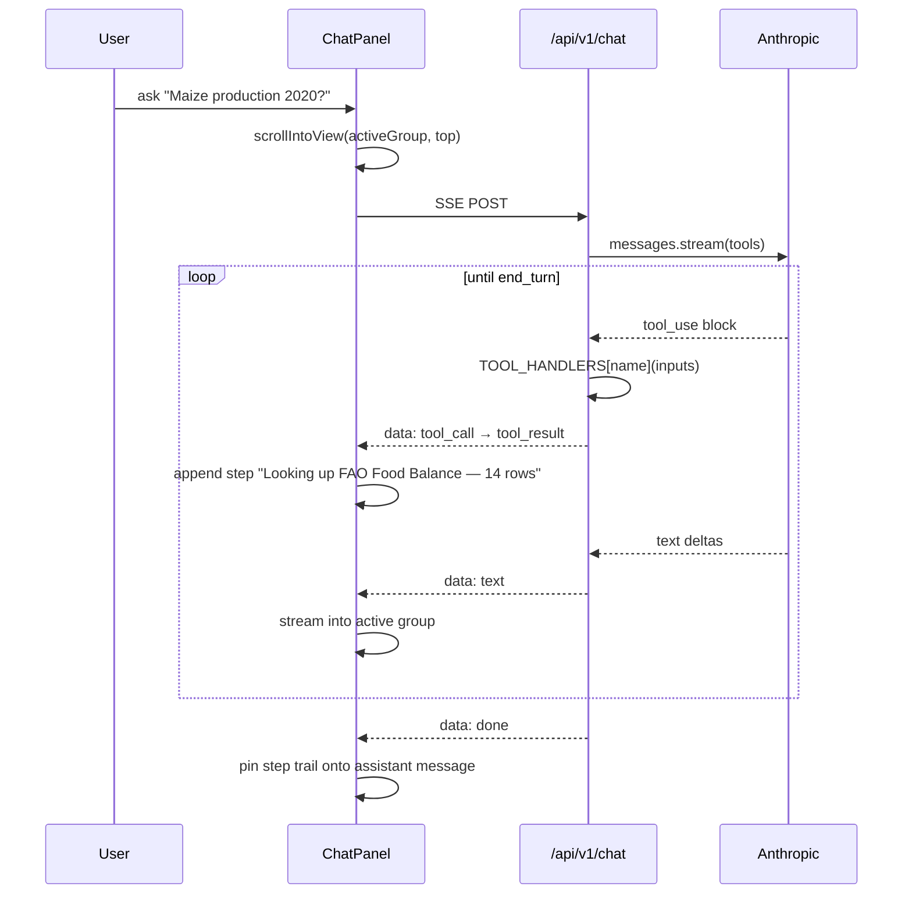

# Crops

Ghana food-market analytics: WFP retail prices, FAO production/trade, GSS regional yields, MoFA actuals, NASA POWER + MODIS climate features, and several yield/price forecasting models — unified in Postgres with a Next.js dashboard and a Claude chat panel.

## Quickstart

```bash
npm install
npm run install:backend
npm run install:frontend
npm run dev
```

→ Frontend at `http://localhost:3000`, FastAPI at `http://localhost:8000` (OpenAPI at `/docs`), Postgres in Docker on `5432`.

## Chat interface

Every analytical surface ships a Claude-powered chat panel — slide-out drawer that streams answers grounded in **app data**, **web search**, or **direct response** depending on what the question needs. Mounted on `/`, `/forecast`, `/map`, and `/trends` from one component (`frontend/src/components/dashboard/ChatPanel.tsx`).

### How a turn flows



### What's distinctive

1. **Q&A pair groups, not a flat list.** Each user message + its assistant reply lives in one container. The active (most recent) group is sized to the scroll viewport (measured in JS via `ResizeObserver`), so a new question always pins to the top of the visible area when sent. Older groups shrink to content.
2. **No auto-scroll during streaming.** The view stays where the user put it — only sending a new message triggers a single `scrollIntoView({ block: "start" })`.
3. **Step trail with vertical rail.** As Claude works, each tool call becomes a step rendered above the assistant bubble: *"Thinking → Looking up FAO Food Balance — 14 rows → Searching the web…"*. The active step pulses; completed steps freeze. The trail persists onto the committed message so scrolling back shows exactly what was looked up to produce each reply.
4. **Five app-data tools** Claude can invoke autonomously: `query_food_prices`, `query_food_balance`, `query_predictions`, `query_producer_prices`, `query_population` — each backed by a small asyncpg query in `backend/app/services/chat_tools.py`.
5. **Retry-with-backoff** on Anthropic 429/503/529 (rate-limited / unavailable / overloaded). The UI shows *"Anthropic is busy — retrying in 8s…"* as a step rather than a hard error.
6. **Source-quality system prompt** — cross-check across credible sources, prefer primary over aggregator, flag unverified figures, no emojis.

Full deep dive (architecture, list/flow diagrams, edge cases): **[docs/CHAT-INTERFACE.md](./docs/CHAT-INTERFACE.md)**.

## Documentation

Complete docs live in [`docs/`](./docs/):

- **[docs/README.md](./docs/README.md)** — overview, repo map, tech stack
- **[docs/ARCHITECTURE.md](./docs/ARCHITECTURE.md)** — system diagram, request lifecycle, data lineage, deployment topology
- **[docs/CHAT-INTERFACE.md](./docs/CHAT-INTERFACE.md)** — chat panel design: agentic tool use, Q&A grouping, step trail, retry & error handling
- **[docs/DATA-SOURCES.md](./docs/DATA-SOURCES.md)** — every external feed and ingestion path
- **[docs/ML-PIPELINES.md](./docs/ML-PIPELINES.md)** — TabPFN, LightGBM, rolling-mean, Prophet
- **[docs/API.md](./docs/API.md)** — full endpoint reference
- **[docs/FRONTEND.md](./docs/FRONTEND.md)** — route map and component catalog
- **[docs/SCHEMA.md](./docs/SCHEMA.md)** — every Postgres table
- **[docs/DEPLOY.md](./docs/DEPLOY.md)** — Heroku deployment runbook

The Mermaid diagrams in those files render natively on GitHub.
