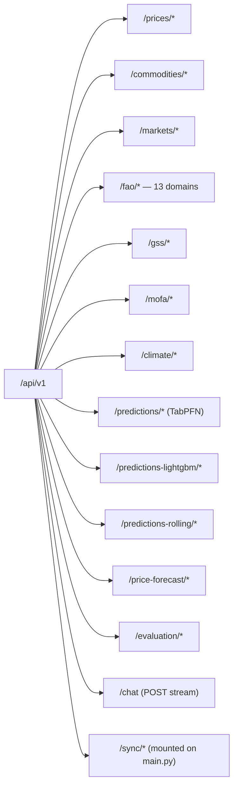

# API reference

All endpoints under `/api/v1`. Backend runs on `localhost:8000` in dev (`localhost:8001` in docker-compose). The full OpenAPI schema is available at `/docs` (Swagger) and `/openapi.json`.

Conventions:

- All read endpoints return JSON: `{"data": [...], "total": <int>}` for paginated lists, or a single object for summaries.
- All sync endpoints return `text/event-stream` (SSE). Each event is `data: {"stage":"…","pct":<int>,"message":"…"}\n\n`. Final event has `stage: "done"` (or `"error"`).
- Pagination uses `?limit=&offset=` (max `limit` typically 1000).
- Filter params on read endpoints follow predictable names: `commodity`, `market`, `region`, `item`, `year`, `year_min`, `year_max`, `date_from`, `date_to`. Not all combinations exist on every endpoint — see code or `/docs`.

## Router map



## `/prices`

Maize-and-friends retail prices from WFP HDEX.

| Method | Path | Purpose |
|---|---|---|
| GET | `/prices/` | Paginated price rows. Filters: `commodity`, `market`, `region`, `date_from`, `date_to`. |
| GET | `/prices/summary` | Per-commodity stat block (latest, MoM %, 24-mo min/max, volatility). |
| GET | `/prices/timeseries` | Long format `(date, commodity, market, price)` for chart consumption. |
| GET | `/prices/regions` | Distinct regions present in the table. |

## `/commodities` / `/markets`

| Method | Path | Purpose |
|---|---|---|
| GET | `/commodities/` | List of commodities with category and unit. |
| GET | `/markets/` | List of markets with lat/lng and region. |

## `/fao` (13 domains under one router)

Each FAOSTAT domain has a read endpoint and (where multi-item) an `/items` discovery endpoint.

| Method | Path | Purpose |
|---|---|---|
| GET | `/fao/cpi` | Monthly CPI rows. Filters: `item`, `start_date_from/to`. |
| GET | `/fao/producer-prices` | Producer prices LCU/tonne. |
| GET | `/fao/items` | Distinct items across producer prices. |
| GET | `/fao/healthy-diet-cost` | Cost-of-Healthy-Diet annual. |
| GET | `/fao/food-security/items` `/fao/food-security` | Food security indicators (e.g. PoU, severe food insecurity). |
| GET | `/fao/exchange-rates` | LCU/USD time series, monthly + annual. |
| GET | `/fao/crop-production/items` `/fao/crop-production` | Production / area-harvested / yield by item. |
| GET | `/fao/value-production/items` `/fao/value-production` | Gross production value, current LCU. |
| GET | `/fao/supply-utilization/items` `/fao/supply-utilization` | Detailed supply chain breakdown. |
| GET | `/fao/population` | Annual population (Total, Rural, Urban). |
| GET | `/fao/trade/items` `/fao/trade` | Imports / Exports quantity & value. |
| GET | `/fao/fertilizer/items` `/fao/fertilizer` | Fertilizer use per nutrient. |
| GET | `/fao/land-use/items` `/fao/land-use` | Land-use class areas. |
| GET | `/fao/food-balances/items` `/fao/food-balances` | Food balance sheet rows (production, food, feed, losses, …). |

Common filter params: `item`, `element`, `year_min`, `year_max`, `limit`, `offset`.

## `/gss` (Ghana Statistical Service)

| Method | Path | Purpose |
|---|---|---|
| GET | `/gss/crop-production` | Filtered rows by `crop`, `region`, `year`. |
| GET | `/gss/crops` | Distinct crops. |
| GET | `/gss/regions` | Distinct regions. |
| GET | `/gss/yields` | Computed `production / area` per (region, year, crop). |
| POST | `/gss/sync` | Multipart upload of GSS CSV. SSE progress. |

## `/mofa`

| Method | Path | Purpose |
|---|---|---|
| GET | `/mofa/national` | National annual totals. |
| GET | `/mofa/maize/regional` | Regional maize panel (yield/area/production by region+year). |
| POST | `/mofa/sync` | Re-load static MoFA CSVs. |

## `/climate`

| Method | Path | Purpose |
|---|---|---|
| GET | `/climate/monthly` | Monthly per-region NASA POWER + MODIS rows. |
| GET | `/climate/annual` | Z-scored annual rows (LightGBM input format). |
| GET | `/climate/anomalies` | Recent year anomaly summary per region. |
| POST | `/climate/sync` | Re-process CSVs in `backend/data/`. |

## `/predictions`, `/predictions-lightgbm`, `/predictions-rolling`

Three parallel APIs with the same shape — frontend's `_MaizePredictionsView` reuses one component across all three.

| Method | Path | Purpose |
|---|---|---|
| GET | `/predictions/maize` | Predictions rows (filter by `region`, `year`, `source`). |
| GET | `/predictions/maize/regions` | Distinct regions. |
| GET | `/predictions/maize/summary` | Per-region accuracy summary on backtest. |
| POST | `/predictions/maize/sync` | TabPFN: load CSV. LightGBM: train + predict. Rolling: compute. SSE progress. |

(swap `/predictions/` for `/predictions-lightgbm/` or `/predictions-rolling/` for the other two.)

## `/price-forecast`

| Method | Path | Purpose |
|---|---|---|
| GET | `/price-forecast/maize` | Per-market monthly forecast rows (`market`, `month_date`, `phase`, GHS+USD with CIs). |
| GET | `/price-forecast/maize/markets` | List of markets with a forecast. |
| GET | `/price-forecast/maize/meta` | Per-market metadata (RMSE, β coefficient, horizon dates). |
| GET | `/price-forecast/maize/summary` | Aggregated cross-market summary (avg horizon GHS, n_markets). |
| POST | `/price-forecast/maize/sync` | Refit Prophet for every market. SSE progress. Slow (~3 min). |

## `/evaluation`

| Method | Path | Purpose |
|---|---|---|
| GET | `/evaluation/maize/compare` | Per-model RMSE/MAE/MAPE on backtest rows. |
| GET | `/evaluation/maize/pairwise` | Win-rate per model pair, by region/year. |

## `/chat`

| Method | Path | Purpose |
|---|---|---|
| POST | `/chat` | Stream a Claude response. SSE. |

Request body:
```json
{
  "crop": "Maize",
  "region": "Ashanti",                      // optional
  "messages": [{"role":"user","content":"…"}],
  "web_search": true                        // default true
}
```

Response: SSE stream of `{"type":"text","text":"…"}` deltas, terminated by `{"type":"done"}` or `{"type":"error","error":"…"}`.

The system prompt scopes the assistant to the given crop (and region when present) and tells Claude to prefer FAOSTAT/GSS/MoFA/WFP sources when web search is on. Model: `claude-sonnet-4-5`. Tools: `web_search_20250305` (max 5 uses per request).

## `/sync/*` (mounted on `main.py`, not the v1 router)

These predate the per-domain `*/sync` endpoints; some still ship for compatibility:

| Method | Path | Purpose |
|---|---|---|
| POST | `/api/v1/sync/hdex` | Re-pull WFP food prices CSV. |
| POST | `/api/v1/sync/fao/{domain}` | Re-pull a FAOSTAT domain (`cpi`, `producer-prices`, …). |
| GET | `/health` | Liveness. |

## Error semantics

- Read endpoints return 200 with empty arrays when filters match nothing — no 404.
- Validation errors (invalid query params) return 422 with FastAPI's standard error envelope.
- DB errors bubble as 500 with the asyncpg message (only safe in dev — in prod we'd want a sanitiser).
- The chat endpoint returns 503 if `ANTHROPIC_API_KEY` is unset (`chat.py:65`).

## Streaming format

SSE format used everywhere there's progress:

```
data: {"stage":"downloading","pct":10,"message":"Pulling HDEX CSV…"}\n\n
data: {"stage":"parsing","pct":40}\n\n
data: {"stage":"inserting","pct":70,"done":1234,"total":1800}\n\n
data: {"stage":"done","pct":100,"records_inserted":1800,"records_skipped":0}\n\n
```

Frontend consumers use the `streamSyncSse` helper in `frontend/src/lib/api.ts`. The chat stream is the same shape but with `{"type":"text"|"done"|"error"}` payloads instead of stage progress.
