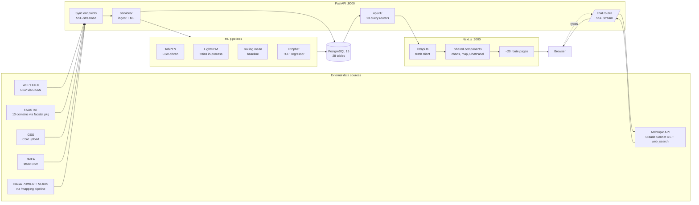
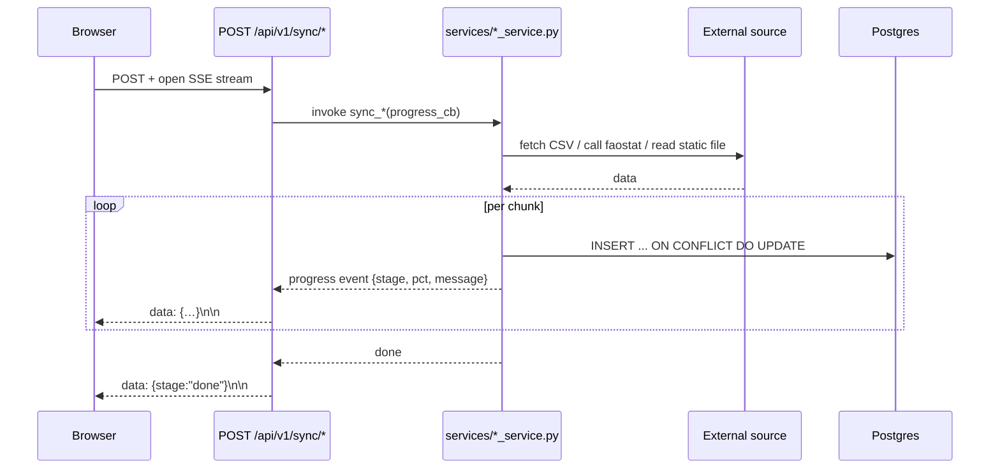
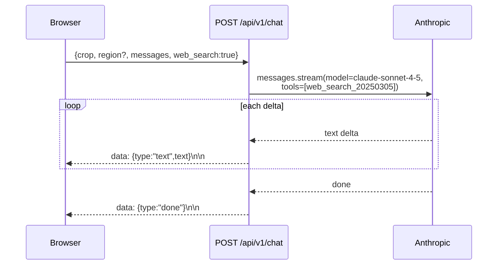
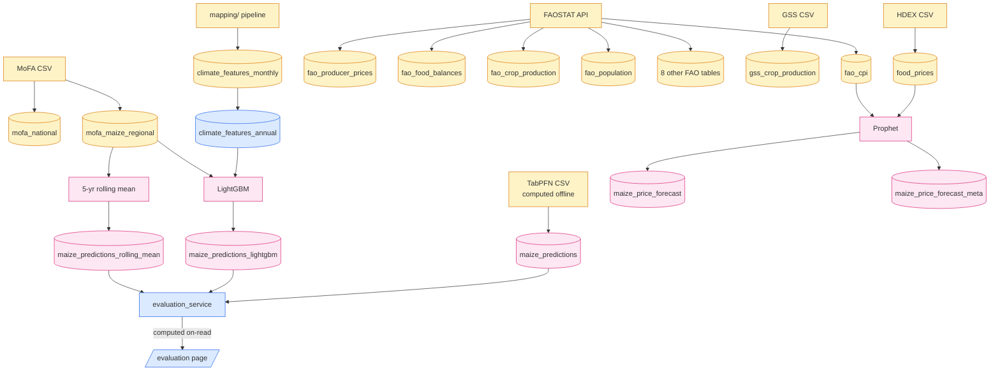
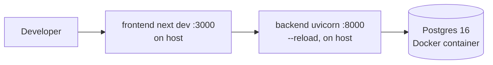
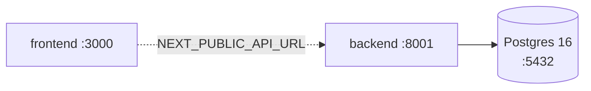

# Architecture

## System diagram



The defining shape: **all data lives in Postgres**. Every external feed is *pulled* by an explicit sync endpoint, normalized in a service module, and written via asyncpg upsert. Every chart on the frontend is one or two REST calls into the same DB. There is no edge cache, no message queue, no async worker — just sync HTTP and a connection pool.

## Request lifecycle

### Read path (a chart loading on the dashboard)

```mermaid
sequenceDiagram
    participant Browser
    participant Next as Next.js (page.tsx)
    participant API as FastAPI (/api/v1/*)
    participant Pool as asyncpg pool
    participant PG as Postgres

    Browser->>Next: GET /dashboard
    Next-->>Browser: HTML + JS bundle
    Browser->>Next: hydrate; useEffect → fetch(/api/v1/prices/timeseries?...)
    Next->>API: forward (or direct, when NEXT_PUBLIC_API_URL is set)
    API->>Pool: acquire conn
    Pool->>PG: SELECT ... FROM food_prices
    PG-->>Pool: rows
    Pool-->>API: rows
    API-->>Browser: JSON
    Browser->>Browser: Recharts renders
```

Latency budget: a single SELECT against a properly-indexed table (`food_prices` has indices on `date`, `commodity`, `market`, `region`) is sub-10 ms; the full round-trip from click to first render is ~80–150 ms in dev.

### Write path (sync button)



Sync endpoints return a `StreamingResponse` of SSE frames so the frontend's `SyncButton` can show live progress instead of a 90-second spinner. Every ingestion path uses the same upsert pattern, so re-running a sync is idempotent.

### Chat path



System-prompt context is injected server-side: the crop name (and optional region) become part of the system message so the assistant knows what scope the user is looking at.

## Data lineage



A few things worth noting:

- **`climate_features_annual` is derived from `_monthly`** during sync — the monthly file is pre-aggregated by the mapping pipeline, then z-scored per region/feature on ingest.
- **TabPFN is offline-trained**; the sync just bulk-loads a pre-computed CSV. LightGBM and rolling-mean train *in-process* on the sync request — they read MoFA + climate, fit, and write predictions in one transaction.
- **Evaluation is computed at read time**, not stored. `/api/v1/evaluation/*` joins the three prediction tables on `(region, year)` where `source = 'backtest'` and computes RMSE/MAE/MAPE per model.

## Deployment topology

The repo ships two run modes:

### Local dev (`npm run dev`)



`concurrently` runs uvicorn + Next dev with prefixed log streams. Postgres is the only thing in Docker; backend + frontend run on the host so hot-reload works against your local Python and node.

### Containerized (`docker compose up`)



All three services in containers; backend on 8001 (note: different port from local dev), volumes mount source for hot reload.

## Key design decisions

| Decision | Rationale |
|---|---|
| **Single Postgres for all data** | Eliminates the "which store has the truth?" problem. Every analytical query is one DB. |
| **All ingestion via explicit sync endpoints** | No background workers means no celery/redis/cron. Every sync is reproducible with `curl`. The cost: refreshes are manual, and we can't claim "live" on a chart older than the last button-press. |
| **asyncpg + raw SQL, not an ORM in the backend** | Most queries here are wide aggregations over a single table. ORMs add ceremony without value. Drizzle is wired *in the frontend* for type generation only — actual queries go through FastAPI. |
| **SSE for sync progress** | Sync runs (especially Prophet across 17 markets) take minutes. SSE gives the user a progress bar instead of a spinner. Native `fetch` + `ReadableStream`, no client lib. |
| **Three yield models in parallel** | Each has different inductive biases (TabPFN: tabular pretraining; LightGBM: gradient boosting on engineered climate features; rolling-mean: naive baseline). The evaluation page compares them honestly on backtest holdouts. |
| **Claude over building a domain model** | The chat panel is for free-form questions that don't fit a chart. Web search keeps it grounded; system prompt scopes to the current crop/region. |
| **Mermaid diagrams in-repo** | Renders on GitHub, version-controlled, readable as plain text in PRs. No Figma round-trip required. |

## What this architecture is bad at

For honest accounting:

- **Live data**. Nothing is "current" past the last sync. WFP CSV stops at 2023-07; that's not a frontend bug, that's the upstream feed.
- **Concurrent writes**. The sync endpoints assume one user is pressing one button at a time; nothing prevents two simultaneous Prophet runs from racing on `maize_price_forecast`.
- **Horizontal scale**. The model training runs in the API process. A real production deployment would extract LightGBM/Prophet into worker jobs (Celery, RQ, or cloud functions).
- **Auth / multi-tenant**. There isn't any. CORS allows localhost; assume single-user.

These are all fine for the current scope (analytical tool, manual operation, single-machine deploy) and clearly cheap to fix when they need fixing.
