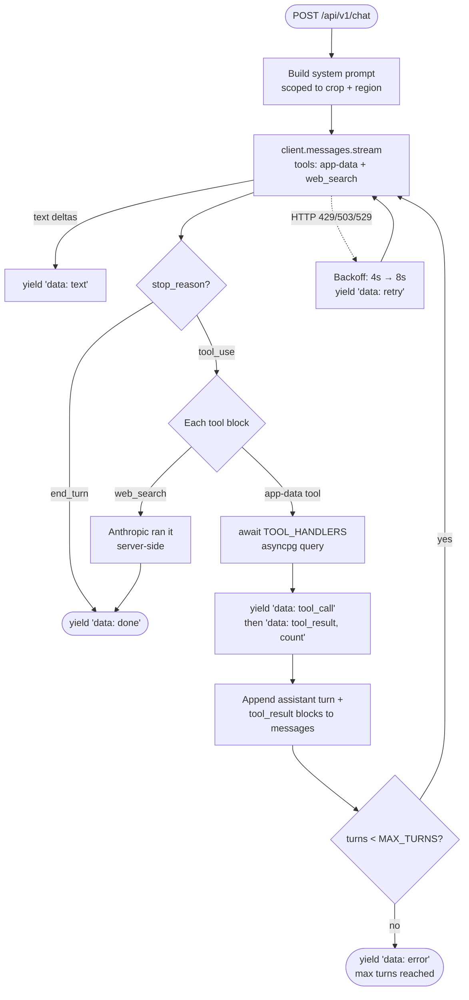
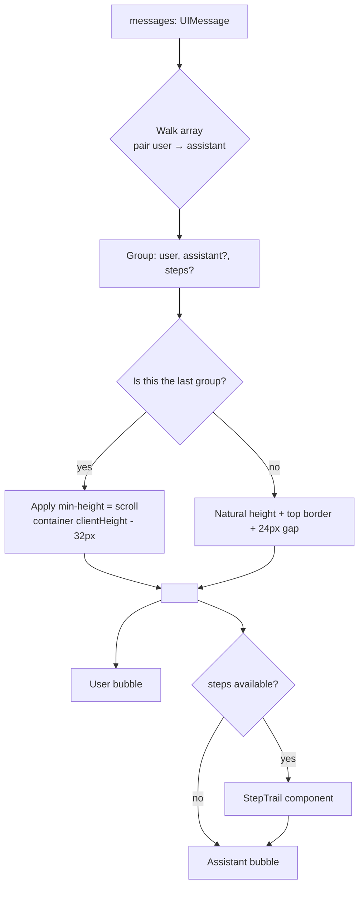
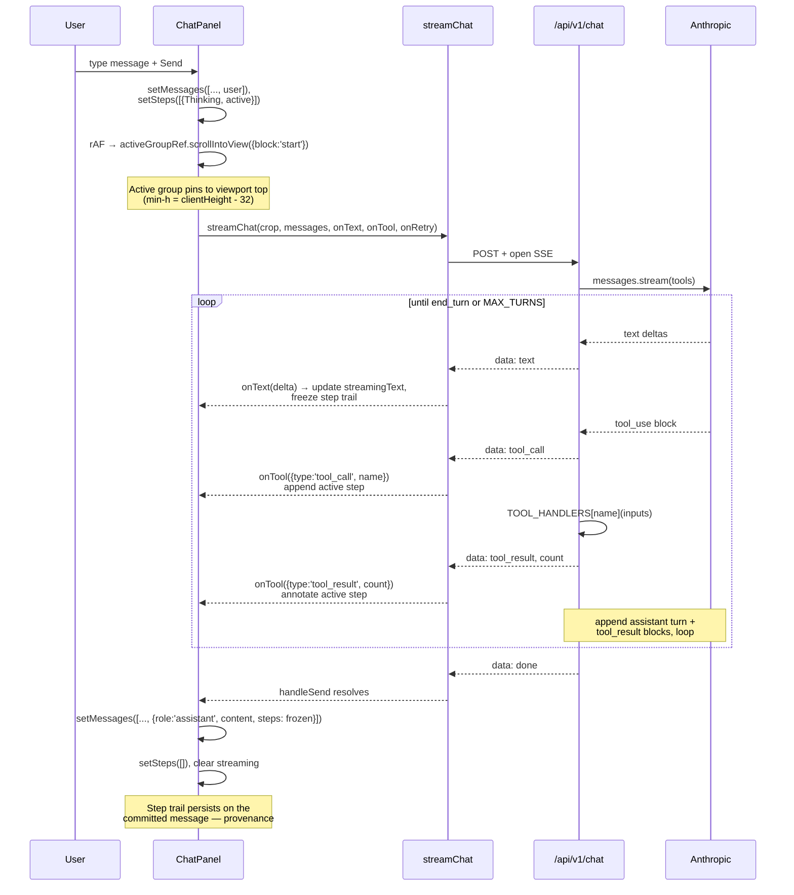

# Chat interface

A right-side drawer that streams Claude responses with **tool use over the app's data** plus optional web search. Rendered on `/`, `/forecast`, `/map`, and `/trends` from one component (`frontend/src/components/dashboard/ChatPanel.tsx`).

## What it does

The user clicks a region on the map (or the "Get current price" button, or any crop signal) → the panel slides in scoped to that crop and region → the user asks a question → Claude decides per turn whether to call an app-data tool, run a web search, or answer directly. Every step is rendered live in the chat thread; the persisted thread carries provenance for every reply.

## Three modes Claude can pick from

| Mode | When | Examples |
|---|---|---|
| **App-data tool** | Question is answerable from the database the page already shows | "What was Ghana's maize production in 2020?", "Compare LightGBM and TabPFN backtest accuracy" |
| **Web search** | Today's prices, news, policy changes, weather, anything past the WFP HDEX cutoff (2023-07) | "Latest fertilizer-subsidy news?", "Current retail maize price in Tamale?" |
| **Direct answer** | Methodology, definitions, follow-up explanations that don't need new data | "What does 'food surplus' mean here?", "Why does the supply line dip in 2014?" |

Five app-data tools are exposed (see `backend/app/services/chat_tools.py`):

- `query_food_prices` — WFP retail/wholesale prices (commodity, market, date range)
- `query_food_balance` — FAO Food Balance Sheet rows for a crop
- `query_predictions` — TabPFN / LightGBM / rolling-mean forecasts
- `query_producer_prices` — FAO producer prices (LCU / USD / PPI)
- `query_population` — Ghana population by year (incl. UN projections)

## Backend — the agent loop



**Key implementation details** (`backend/app/api/v1/chat.py`):

- **MAX_TURNS = 6** — caps the agent loop so a misbehaving model can't loop forever.
- **Retry on transients** — 429 (rate limit), 503 (service unavailable), 529 (Anthropic-specific overload). Two retries with exponential backoff. Each retry emits an SSE `retry` event so the UI can show "Anthropic is busy — retrying in 8s…" instead of a hard error.
- **Friendly errors** — APIStatusError gets mapped to plain English ("Anthropic is currently overloaded. Please try again in a moment."); the raw envelope only ever surfaces in server logs alongside the `request_id`.
- **Server-side web_search** — Anthropic executes the search itself; we never see the tool body, just the final text. `web_search` blocks are *not* dispatched to `TOOL_HANDLERS`.
- **Source-quality system prompt** — cross-check across credible sources, prefer primary over aggregator, flag unverified figures, no emojis.

## Stream protocol (SSE)

```
data: {"type": "text", "text": "..."}                            ← incremental delta
data: {"type": "tool_call", "name": "query_food_balance"}        ← model invoked a tool
data: {"type": "tool_result", "name": "...", "count": 14}        ← tool returned N rows
data: {"type": "retry", "after_seconds": 8, "reason": "overloaded"}
data: {"type": "done"}                                           ← end of turn
data: {"type": "error", "error": "..."}
```

Frontend consumer is `streamChat` in `frontend/src/lib/api.ts`. It exposes three callbacks: `onText`, `onTool`, `onRetry`. `error` events throw inside the stream loop and surface as a chat error block.

## Frontend — the list

The thread is **not** a flat list of messages. It's a list of **Q&A pair groups**, where one group = one user message + (optional) assistant reply + (optional) step trail.



### Why groups, not a flat list?

Without grouping, sending a new message lands somewhere ambiguous and the user has to scroll to find their question. With grouping + viewport-tall active group:

1. Each user question pins to the top of the visible area when sent.
2. The assistant reply unfolds below, in the same visual container.
3. Older groups shrink to content height and scroll above the fold.
4. **No auto-scroll during streaming** — the user reads at their own pace; the response stays in place.

### Sizing the active group

The active group needs to be **at least viewport-tall** so total content exceeds the scroll viewport, which is the precondition for `scrollIntoView({ block: "start" })` to actually scroll. Naively, you might write `min-h-full` and call it done — but CSS percentage min-heights don't reliably resolve when the chain of ancestors mixes `min-height` and `auto` heights.

The bulletproof fix is to measure the scroll container in JS and apply the result inline:

```tsx
const [scrollAreaHeight, setScrollAreaHeight] = useState(0);

useEffect(() => {
  const el = scrollRef.current;
  if (!el) return;
  const measure = () => setScrollAreaHeight(el.clientHeight);
  measure();
  const ro = new ResizeObserver(measure);
  ro.observe(el);
  return () => ro.disconnect();
}, [open]);

// In render:
<div
  ref={isActive ? activeGroupRef : null}
  style={isActive && scrollAreaHeight > 0 ? { minHeight: `${scrollAreaHeight - 32}px` } : undefined}
  className="flex flex-col gap-3 ..."
>
```

The `ResizeObserver` keeps the height in sync as the user resizes the panel.

## Frontend — the flow



### Steps render as a tree

The step trail (`StepTrail` component) shows each step in chronological order with a **single continuous vertical rail** running through the icon centers. The active step pulses; completed steps render at reduced opacity. Logos sit on top of the rail (`z-10` + `bg-card`) so they punch through the line at each step's position.

```
●  Thinking
│
●  Looking up FAO Food Balance — 14 rows
│
●  Searching the web…
```

Same component renders both the live in-flight trail and the persisted trail above each completed assistant message. The only difference: the live trail's most recent step animates; the persisted one doesn't.

## Auto-grow composer

The textarea ref is read every keystroke; height resets to `auto`, then sets to `scrollHeight` (capped by the CSS `max-height: 10rem`). Without the auto reset, deleting text wouldn't shrink the box back down — `scrollHeight` would stay at the previous tall value.

## Edge cases handled

| Situation | Behavior |
|---|---|
| Same `initialPrompt` arrives twice (e.g., repeated button clicks) | Deduped via `lastFiredPromptRef` — only the first fires |
| Crop or region changes mid-conversation | Thread resets so the assistant doesn't keep referring to the previous scope |
| `position: fixed` panel inside an `animate-fade-in` ancestor | Panel rendered as a sibling of the animated div via `<>` wrapper — `transform` would otherwise create a new containing block and pin the panel inside the page |
| Long answer exceeds the viewport-tall active group | `min-height` doesn't cap; group expands; user scrolls within naturally |
| Anthropic transient overload | Retry with backoff; UI shows "Retrying in 8s…" as a step instead of an error block |
| Rate limit | Same path; reason text differs |
| Connection error | Same path; reason text differs |
| All retries exhausted | Friendly error block at the bottom of the thread (Anthropic raw envelope is logged, not displayed) |

## What lives where

| File | Responsibility |
|---|---|
| `backend/app/api/v1/chat.py` | SSE endpoint, agent loop, tool dispatch, retry/error handling, system prompt |
| `backend/app/services/chat_tools.py` | The 5 app-data tool handlers (asyncpg queries) |
| `frontend/src/lib/api.ts` | `streamChat` — fetch + parse SSE → callbacks |
| `frontend/src/components/dashboard/ChatPanel.tsx` | Drawer UI, group derivation, step trail, composer, auto-scroll-on-send |

## Why "Q&A pair" and not "by message"

Two design choices shaped this:

1. **Without auto-scroll, the user must always know where to look.** A flat append-only list has no anchor — when streaming starts, the answer might appear above, below, or partially in view depending on where the user happened to be. Pairing each question with its answer in a viewport-tall container makes the landing point deterministic: top of the new group.

2. **Provenance lives with the answer.** When Claude calls three tools to compose one answer, that's part of the answer — not separate messages. Pinning the step trail above the assistant bubble (and persisting it after commit) means a user scrolling back through history can see exactly what was looked up to produce each reply.
