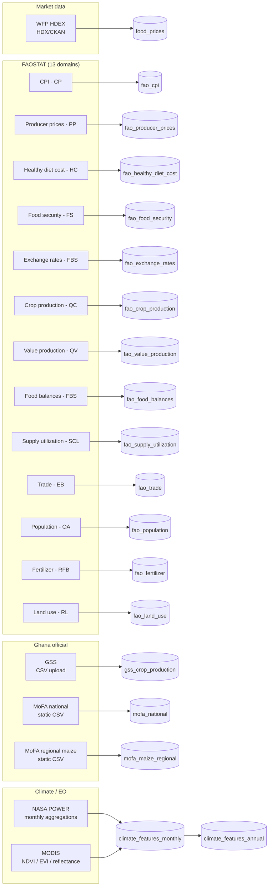

# Data sources

Every external feed in the system, with the path it takes from the source to a Postgres row.

## Overview

## Per-source detail

### WFP HDEX food prices

| | |
|---|---|
| **Source** | WFP-published Ghana food prices CSV, distributed via the Humanitarian Data Exchange (HDEX) on CKAN |
| **Service** | `backend/app/services/wfp_service.py` (`fetch_hdex_csv_data`) |
| **Sync endpoint** | `POST /api/v1/sync/hdex` |
| **Credentials** | None — public CSV |
| **Target table** | `food_prices` |
| **Granularity** | Monthly retail/wholesale/producer prices per (commodity, market, region) |
| **Coverage** | 2006-01 → 2023-07 (upstream stops there) |
| **Rows** | ~3,500 maize-only; tens of thousands across all commodities |
| **Idempotency** | Upsert on `(commodity, market, date, price_type)` |

The WFP commodity vocabulary doesn't always match Ghana common names (e.g. "Maize (white)" vs "Maize"); the service normalises some aliases on the way in but leaves most of the long-tail. See `wfp_service.py` for the full list.

### FAOSTAT (13 domains)

| | |
|---|---|
| **Source** | FAOSTAT bulk-download API, accessed via the [`faostat`](https://pypi.org/project/faostat/) Python package |
| **Service** | `backend/app/services/fao_service.py` |
| **Sync endpoints** | `POST /api/v1/sync/fao/{domain}` for each of the 13 domains |
| **Credentials** | Optional FAOSTAT account (set `FAOSTAT_USERNAME` / `FAOSTAT_PASSWORD`) — most domains work without |
| **Target tables** | `fao_*` (13 tables, one per domain) |
| **Idempotency** | Upsert per domain on `(item, element, year)` or equivalent natural key |

The 13 domains, with their FAOSTAT codes and table targets:

| FAOSTAT code | Domain | Table |
|---|---|---|
| CP | Consumer Prices Index | `fao_cpi` |
| PP | Producer Prices | `fao_producer_prices` |
| HC | Healthy Diet Cost | `fao_healthy_diet_cost` |
| FS | Food Security Indicators | `fao_food_security` |
| FBS | Exchange Rates | `fao_exchange_rates` |
| QC | Crop & Livestock Production | `fao_crop_production` |
| QV | Value of Production | `fao_value_production` |
| FBS-new | Food Balances (post-2010) | `fao_food_balances` |
| SCL | Supply Utilization Accounts | `fao_supply_utilization` |
| EB | Trade — Crops & Livestock | `fao_trade` |
| OA | Annual Population | `fao_population` |
| RFB | Fertilizers | `fao_fertilizer` |
| RL | Land Use | `fao_land_use` |

Each table stores `(year, item_code, element_code, value, unit, flag)` plus the human-readable `item`/`element` strings. **Units vary by table** — e.g. `fao_food_balances.production` is in 1000-tonnes, `fao_crop_production.production` is in tonnes. See [SCHEMA.md](./SCHEMA.md) for unit conventions and [the chart-side conversion](../frontend/src/components/dashboard/CropBalanceChart.tsx) for an example of mixing them.

### Ghana Statistical Service (GSS)

| | |
|---|---|
| **Source** | GSS-published crop production figures (Excel/CSV) |
| **Service** | `backend/app/services/gss_service.py` + `gss_normalize.py` |
| **Sync endpoint** | `POST /api/v1/sync/gss` (CSV upload via multipart) |
| **Target table** | `gss_crop_production` |
| **Granularity** | Year × region × district × crop |
| **Crop normalization** | `gss_normalize.py` maps GSS-spelling crop names (e.g. "Cassava (Tuber)") to a canonical form so downstream joins with FAO/MoFA data work |

### MoFA (Ministry of Food & Agriculture)

| | |
|---|---|
| **Source** | MoFA SRID statistical bulletins (static CSVs in `backend/data/`) |
| **Service** | `backend/app/services/mofa_service.py` |
| **Sync endpoint** | `POST /api/v1/sync/mofa` |
| **Target tables** | `mofa_national`, `mofa_maize_regional` |
| **Granularity** | National annual totals + regional maize panels |
| **Coverage** | 2002 → 2023 for regional maize |

Regional maize is the basis for the LightGBM training target — every region/year row in `mofa_maize_regional` is a label.

### Climate features (NASA POWER + MODIS)

| | |
|---|---|
| **Source** | NASA POWER (T2M, RH, radiation, precipitation, …) + MODIS (NDVI, EVI, reflectance bands), aggregated per Ghana region monthly |
| **Pipeline** | The `mapping/` directory is a separate offline aggregation — outputs two CSVs into `backend/data/` |
| **Service** | `backend/app/services/climate_service.py` |
| **Sync endpoint** | `POST /api/v1/sync/climate` |
| **Target tables** | `climate_features_monthly` (raw), `climate_features_annual` (aggregated + z-scored per region) |
| **Coverage** | 2000 → ~2024 monthly |

The annual table is computed from the monthly one *during sync*: each of the 31 climate columns is averaged per (region, year), then z-scored across years per region so the LightGBM model sees stationary inputs even as the climate drifts.

## Refresh cadence

Everything is **manual**. There is no scheduler. Each ingestion is one of:

1. **Frontend "Sync" button** — most common; runs `POST /api/v1/sync/<source>` with SSE progress. Used for WFP, FAOSTAT domains, GSS upload.
2. **`curl` from a terminal** — for any sync endpoint that doesn't have a frontend button (climate, MoFA static CSVs).
3. **External cron** — not configured by default. To run nightly, point a cron job at the sync endpoints; they're idempotent.

The "data freshness" displayed on the frontend is *not* automatically tracked. If you want a "last synced" timestamp per source, that's a TODO — `database.py` doesn't currently carry an ingestion-metadata table.

## Adding a new data source

The existing pattern is consistent enough to copy:

1. **Define the table** in `backend/app/db/database.py` next to the other `CREATE TABLE` statements. Pick a natural key for the upsert.
2. **Write the service** in `backend/app/services/<source>_service.py` — async function that fetches the source, parses, and writes via the asyncpg pool. Take a `progress_cb` argument for SSE.
3. **Add a router** under `backend/app/api/v1/<source>.py` with a `POST /sync` SSE endpoint and read endpoints. Include it in `router.py`.
4. **(Optional) Add a frontend client function** in `frontend/src/lib/api.ts` and a page under `frontend/src/app/<route>/page.tsx`.

See `wfp_service.py` + `prices.py` (via `wfp` integration) as the cleanest reference.
