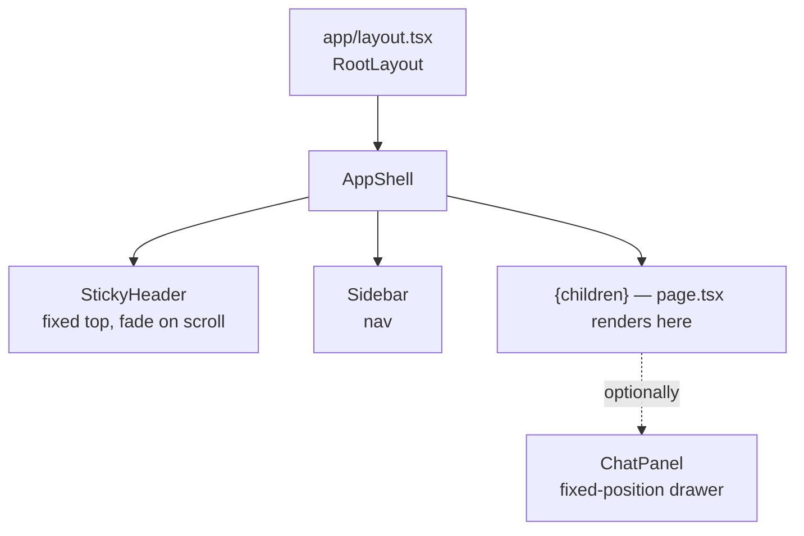

# Frontend

Next.js 15 App Router (React 19, TypeScript, Tailwind). Every page is a client component (`"use client"`) that fetches from `/api/v1/*` on mount.

## Stack notes

- **Recharts** — every chart. We avoid D3 directly except inside RegionalMap (which uses `react-simple-maps` + `d3-geo` for projections).
- **Tailwind CSS** with a small design-token layer in `frontend/src/lib/design-tokens.ts` — central palette, semantic colors (production/exports/cpi/etc.), grid stroke. Every chart pulls from here.
- **Lucide icons** for everything UI-chrome.
- **react-markdown + remark-gfm** for rendering Claude responses in the chat panel.
- **Drizzle ORM** is installed and configured (`frontend/drizzle.config.ts`) but **runtime queries go through the FastAPI backend**, not Drizzle. The Drizzle config exists for type generation against the same Postgres if/when we want it.

## Layout



Every page renders its content inside `AppShell`. The chat panel is rendered *outside* the page's `animate-fade-in` wrapper (transformed ancestors break `position: fixed`) — see [`/forecast/page.tsx`](../frontend/src/app/forecast/page.tsx) for the canonical example.

## Route map

| Route | File | Purpose |
|---|---|---|
| `/` | `app/page.tsx` | Signals home — trending crop hero, production momentum, yield trends, balance signals, market movers, volatility. |
| `/dashboard` | `app/dashboard/page.tsx` | WFP price line chart + price table per commodity/market. |
| `/trends` | `app/trends/page.tsx` | Cross-crop price trend explorer. |
| `/crops` | `app/crops/page.tsx` | Multi-crop balance grid (CropBalanceChart per crop). |
| `/map` | `app/map/page.tsx` | Regional choropleth (production / yield) with market markers. |
| **Forecast** | | |
| `/forecast` | `app/forecast/page.tsx` | Demand & Supply Forecast — regional map + 3 KPI tiles + supply chart + demand chart + sticky right rail (timeline + supply-vs-demand). Region click opens chat panel scoped to that region. |
| `/forecast/maize` | `app/forecast/maize/page.tsx` | Per-market Prophet price forecast detail. |
| `/forecast/maize-prices` | `app/forecast/maize-prices/page.tsx` | Cross-market price forecast comparison. |
| **Predictions (yield models)** | | |
| `/predictions/maize` | `app/predictions/maize/page.tsx` | TabPFN — uses `_MaizePredictionsView`. |
| `/predictions/maize-lightgbm` | `app/predictions/maize-lightgbm/page.tsx` | LightGBM — same shared view. |
| `/predictions/maize-rolling` | `app/predictions/maize-rolling/page.tsx` | Rolling-mean baseline — same shared view. |
| `/predictions/maize-prices` | `app/predictions/maize-prices/page.tsx` | Same shared view but for price model. |
| **Analysis** | | |
| `/analysis/prices` | | WFP + FAO producer prices side-by-side. |
| `/analysis/climate` | | Climate anomalies per region. |
| `/analysis/maize` | | Production decomposition (national + regional + climate). |
| `/analysis/trade` | | Imports/exports from FAO trade. |
| `/analysis/supply` | | Food balance: production / imports / consumption / surplus. |
| `/analysis/demand` | | Food security & healthy diet cost. |
| **Reference views** | | |
| `/yields/maize` | | MoFA regional yield panels with prediction overlays. |
| `/evaluation/maize` | | Model leaderboard (TabPFN vs LightGBM vs rolling-mean). |
| `/gss` | | GSS upload + crop production browser. |
| `/fao` | | FAO data explorer (CPI, trade, balances, …). |
| `/climate` | | Climate features visualisation. |

## Shared components (`src/components/dashboard/`)

| Component | Purpose | Used by |
|---|---|---|
| `AppShell.tsx` | Layout shell — sidebar, header, content area | every page (via root layout) |
| `Sidebar.tsx` | Primary navigation | AppShell |
| `StickyHeader.tsx` | Top bar that hides on scroll-down, shows on scroll-up | AppShell |
| `LogoMark.tsx` | Animated CROPS wordmark | StickyHeader, ChatPanel |
| `ChatPanel.tsx` | Fixed-position drawer that streams Claude responses. Accepts `crop` and optional `region`. | `/forecast`, `/`, `/trends` |
| `CropBalanceChart.tsx` | Self-contained crop food-balance chart with TabPFN forecast overlay. Reusable across pages. | `/`, `/crops` |
| `PriceLineChart.tsx` | Recharts line chart with the standard semantic palette. | `/dashboard`, `/analysis/prices` |
| `PriceTable.tsx` | Paginated price row table with sortable columns. | `/dashboard` |
| `RegionalMap.tsx` | Ghana choropleth + market markers. Now exposes `onRegionSelect` so callers can react to clicks. | `/map`, `/forecast` |
| `StatCards.tsx` | KPI card grid (latest, MoM, volatility). | `/dashboard`, `/` |
| `SyncButton.tsx` | Generic SSE-streaming sync trigger with progress bar. | every sync-capable page |

## Naming + conventions

- **`page.tsx`** is always the route entry. Sub-components live in the same folder if they're page-specific, otherwise under `components/dashboard/`.
- **`_MaizePredictionsView.tsx`** is a shared view component (the leading underscore is a Next.js convention for non-route files in the `app/` tree). Three different prediction routes use it.
- **`lib/api.ts`** is the central fetch client. Every backend call goes through one of its exported functions — never `fetch()` directly inside a component. This keeps types consistent and gives one place to swap base URLs / add auth.
- **`lib/design-tokens.ts`** holds the palette + semantic colors. Charts read from here, not from hex literals.

## State management

Almost no global state. Each page owns its data via `useState` + `useEffect` and re-fetches on filter changes. A few patterns repeated everywhere:

- **`cancelled` flag** in cleanup to avoid setting state after unmount during async fetches.
- **`useMemo`** for any derived series the chart consumes — recharts re-renders are cheap but data normalisation isn't.
- **localStorage** for a couple of persistent preferences (`crops:chat:webSearch` is the only one currently).

No Redux, no Zustand, no React Query. The page-fetches-its-own-data pattern is fine at this scale; if pages start sharing state it's an obvious upgrade path.

## Animations

The `animate-fade-in` Tailwind utility is applied to most page roots. **Important**: this leaves a `transform` value on the element after the animation completes (`fill-mode: both`), which breaks `position: fixed` for descendants. The fix used everywhere a fixed drawer/panel exists is to render the panel as a **sibling** of the animated wrapper, not a child:

```tsx
return (
  <>
    <div className="space-y-5 animate-fade-in">
      {/* page content */}
    </div>
    <ChatPanel ... />     {/* ← outside the animated div */}
  </>
);
```

This is documented inline on every page that uses ChatPanel so it doesn't get re-broken.

## Adding a new page

1. Create `frontend/src/app/<route>/page.tsx`.
2. Mark `"use client"` if you need hooks.
3. Wrap content in `<div className="space-y-5 animate-fade-in">`.
4. Fetch via `lib/api.ts` (add a function there if needed; don't `fetch()` inline).
5. Use existing chart/table components when possible; reach for new ones only when the existing ones don't fit.
6. Add a sidebar link in `Sidebar.tsx` if it should be navigable.

## Frontend ↔ Backend contract

The frontend assumes the backend is at `process.env.NEXT_PUBLIC_API_URL` (default `http://localhost:8000`). The lib/api.ts client never falls back silently — if a fetch returns non-2xx, the page surfaces the error rather than rendering empty charts. This is deliberate: silent empty states mask data pipeline problems.
