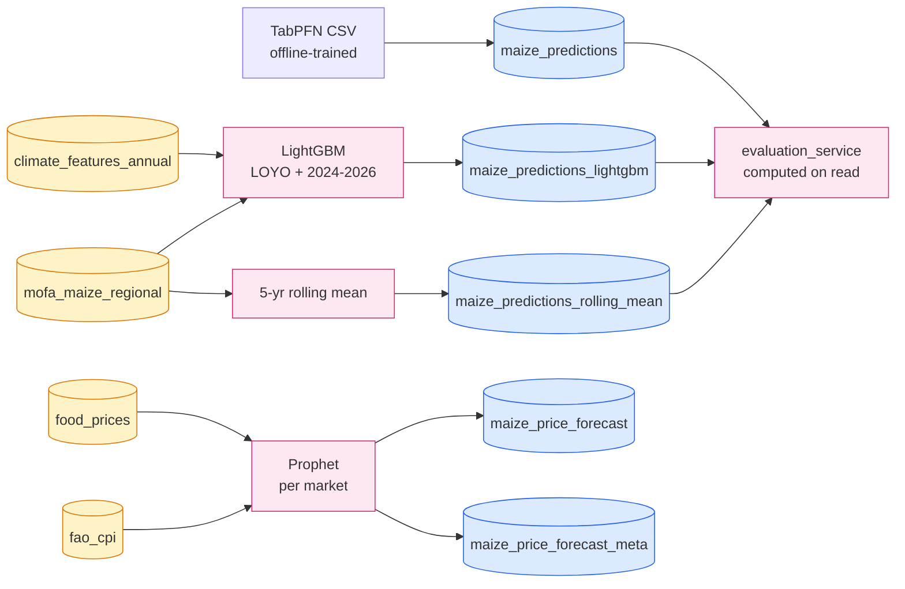
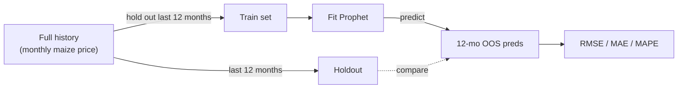

# ML pipelines

Four model pipelines, all writing to dedicated tables, all triggered by sync endpoints. Two are yield models for maize (LightGBM + rolling-mean baseline + an offline-trained TabPFN bulk-load), one is a price model (Prophet per-market with CPI as exogenous regressor).

## Pipeline summary



## TabPFN (`maize_predictions`)

| | |
|---|---|
| **Service** | `backend/app/services/predictions_service.py` |
| **Sync endpoint** | `POST /api/v1/predictions/maize/sync` |
| **Source** | Pre-computed CSV (`maize_predictions_tabpfn_full.csv`) trained out-of-band |
| **Output table** | `maize_predictions` (rows split by `source ∈ {backtest, future_tabpfn}`) |

The sync just bulk-loads a CSV — there's no in-process training. TabPFN itself is a foundation model for tabular data (Hollmann et al.); the offline pipeline that produced this CSV uses climate features × regional yield/area history. We keep TabPFN out of the live API process because its inference graph is heavy and we don't need to retrain on every sync.

**Backtest rows** pair `actual_yield/area/production` with `pred_*` for each (region, year) where actuals exist. **Future rows** (`source = future_tabpfn`) carry only `pred_*` for years past the last actual.

## LightGBM (`maize_predictions_lightgbm`)

| | |
|---|---|
| **Service** | `backend/app/services/lightgbm_predictions_service.py` |
| **Sync endpoint** | `POST /api/v1/predictions-lightgbm/maize/sync` |
| **Output table** | `maize_predictions_lightgbm` |

Trains *in-process* on every sync. Two phases:

### Phase 1 — Leave-One-Year-Out backtest

For each year `y` in 2000–2023:

1. Train LightGBM on every (region, year') row where `year' ≠ y`, with target `mofa_maize_regional.{avg_yield_mt_ha, total_area_ha, total_production_mt}` and features from `climate_features_annual` joined on `(region, year)`.
2. Predict for every region in year `y`.
3. Write `(region, y, source='backtest', actual_*, pred_*)` to the table.

This produces honest out-of-fold predictions: every backtest row was generated by a model that had not seen that year.

### Phase 2 — Future forecast 2024–2026

1. Train on the full 2000–2023 set (no holdout).
2. Predict for `FUTURE_YEARS = (2024, 2025, 2026)`. Climate features for 2024+2025 come from the `climate_features_annual` table (NASA POWER reaches into the present); for 2026 we **carry forward the 2025 climate vector** since 2026 climate isn't observed yet — `lightgbm_predictions_service.py:287`.
3. Write `(region, fy, source='future', actual_*=NULL, pred_*)`.

### Hyperparameters

```python
LGBMRegressor(
    num_leaves=15,        # capped — ~250 training rows
    learning_rate=0.05,
    n_estimators=400,
    min_data_in_leaf=5,
)
```

Conservative settings for a small dataset. Three independent regressors are trained — one each for yield, area, and production — rather than predicting yield then deriving production. The reason: training all three lets us compare model-vs-actual on every column independently and surface where it fails.

### Feature set

All 31 columns from `climate_features_annual` minus `(region, year)`:

- Temperature (6) — t2m, t2m_max, t2m_min, t2m_range, t2m_dew, t2m_wet
- Humidity / pressure (3) — rh2m, qv2m, ps
- Radiation (3) — allsky_sw_dwn, clrsky_sw_dwn, allsky_par_tot
- Wind (4) — ws2m, ws2m_max, ws2m_min, wd2m
- Soil moisture (3) — gwetroot, gwettop, gwetprof
- Precipitation (4) — prectotcorr, total_precip_mm, avg_precip_mm, rainy_days
- Vegetation indices (7) — ndvi, evi, vi_quality, red/nir/blue/mir reflectance

Plus a small number of lag features computed per region (`_lag_features` in the service) so the model has access to the previous year's outturn.

### Honest framing

LightGBM on ~250 rows is a small-data exercise. The LOYO scheme is the right validation strategy (the only one that reflects "predict next year given past years"); even so, expect noisy backtest accuracy. The evaluation page surfaces this directly — see [`/evaluation/maize`](../frontend/src/app/evaluation/maize/page.tsx).

## Rolling-mean baseline (`maize_predictions_rolling_mean`)

| | |
|---|---|
| **Service** | `backend/app/services/rolling_mean_service.py` |
| **Sync endpoint** | `POST /api/v1/predictions-rolling/maize/sync` |
| **Output table** | `maize_predictions_rolling_mean` |

For each (region, year) target, the prediction is the **mean of that region's prior 5 years** of yield / area / production. No features, no training. Both backtest and future rows are produced by the same rule (the future rows just use the most recent 5 years of data without a holdout).

This is the floor every other model has to clear. If LightGBM doesn't beat the 5-year mean, the climate features aren't pulling their weight.

## Prophet price forecast (`maize_price_forecast` + meta)

| | |
|---|---|
| **Service** | `backend/app/services/price_forecast_service.py` |
| **Sync endpoint** | `POST /api/v1/price-forecast/maize/sync` |
| **Output tables** | `maize_price_forecast` (per-market monthly rows), `maize_price_forecast_meta` (per-market metrics) |

Per-market Prophet model with CPI as exogenous regressor. Two passes per market:

### Backtest pass (honest validation)



`HOLDOUT_MONTHS = 12`. Drop the last 12 months from training; fit Prophet on the rest; predict the holdout period; compare against actuals to compute RMSE/MAE/MAPE. These metrics are stored on `maize_price_forecast_meta` per market and surfaced on the [`/forecast/maize-prices`](../frontend/src/app/forecast/maize-prices/page.tsx) page.

### Production pass (forecast)


`FORECAST_MONTHS = 12`. Fit on the full series (no holdout) so the production forecast incorporates the most recent observations. Predict 12 months past the last training month.

### Prophet config

```python
Prophet(
    seasonality_mode="multiplicative",
    weekly_seasonality=False,
    daily_seasonality=False,
    yearly_seasonality=True,
)
.add_regressor("cpi_log")
```

- **Multiplicative seasonality** — price swings scale with the level, not absolute size
- **Yearly only** — monthly data, no weekly/daily structure
- **Log-CPI exogenous regressor** — the model learns a coefficient β such that 1% CPI move ↔ β% price move. Stored on `maize_price_forecast_meta.cpi_beta` and shown in the UI

The historical CPI input comes from `fao_cpi` (Ghana CPI by item). Future CPI is **projected** by a separate Prophet model on CPI alone, so the per-market regressor has values into the forecast horizon.

### USD prices

GHS prices are modeled directly. USD prices are derived via a **separate Prophet FX model** (log GHS/USD), then `pred_price_usd = pred_price_ghs / pred_fx`. CIs propagate through the FX uncertainty. See `_inflate_with_cpi` and `_build_fx_history` in the service.

### Phases in the output

`maize_price_forecast.phase` takes one of three values:

| phase | meaning | actuals? |
|---|---|---|
| `train` | history months in the training set | yes |
| `backtest` | last 12 history months held out from training | yes (out-of-sample preds) |
| `forecast` | 12 months past last history | no |

The frontend forecast chart layers these as: solid actual line through `train`+`backtest`, dashed prediction line on top covering all phases, and a confidence band only on `forecast`.

### Why so slow?

A full sync trains 17 markets × 2 passes × Prophet's Stan compile = several minutes. The endpoint streams progress per market via SSE so the UI shows live updates. If this becomes a problem, the obvious extraction is to push it to a Celery worker — but for a single-machine deploy with manual syncs, the wait is acceptable.

## Evaluation (`/api/v1/evaluation/*`)

| | |
|---|---|
| **Service** | `backend/app/services/evaluation_service.py` |
| **No table** | metrics are computed on every read |

The `compare_maize_models()` function joins the three prediction tables (`maize_predictions`, `maize_predictions_lightgbm`, `maize_predictions_rolling_mean`) on `(region, year)` where `source = 'backtest'` and `actual_yield IS NOT NULL`, then computes:

- **Per model**: RMSE, MAE, MAPE for yield / area / production
- **Pairwise**: which model has lower error per (region, year), aggregated to a winrate %

The `/evaluation/maize` page renders this as a leaderboard table + a per-region scatter so you can see where each model breaks.

## Honest accounting

| Concern | Reality |
|---|---|
| **Sample size** | LightGBM on ~250 rows is genuinely small. Rolling-mean is occasionally competitive — that's a real signal, not a bug. |
| **Hyperparameter tuning** | None. Defaults set by hand based on data size. Cross-validated tuning would be a clear next step but wasn't done. |
| **Climate forecast inputs** | We use observed climate where available. For future-year predictions past observed climate (currently 2026), we carry forward the prior year's climate vector. This biases future predictions toward "average climate continues" — flagged in the service comment. |
| **Prophet trend changepoints** | Default Prophet changepoint detection (n=25). For Ghana cereal prices with a long-running trend break (e.g. cedi devaluation), this can over- or under-fit. Not currently configured. |
| **No global hold-out for the price model** | The 12-month holdout is the only validation. There's no separate "test year never seen" set. Acceptable given the size of the price series; flagging anyway. |
| **TabPFN training is opaque** | Since the CSV is bulk-loaded, the training procedure isn't reproducible from this repo. The CSV needs to be regenerated externally if you change features or extend the horizon. |
