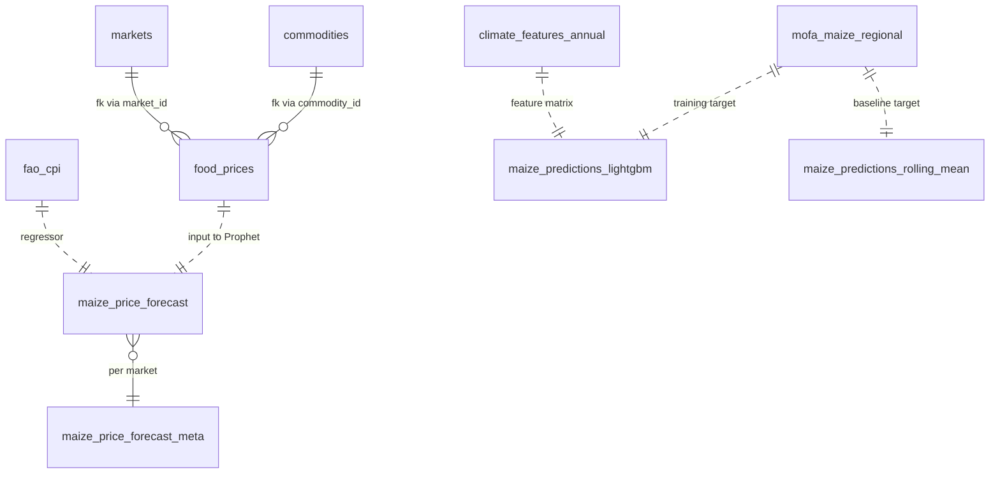

# Database schema

26 tables across 5 domains. Source of truth: [`backend/app/db/database.py`](../backend/app/db/database.py). Postgres 16, asyncpg pool (min_size=2, max_size=10), lifespan-managed in `main.py`.

## Domain overview



The dotted arrows are **logical** (no FK), since predictions are written by services that resolve their inputs at sync time. The hard FKs are only on `food_prices.commodity_id` / `market_id`.

## Core (3 tables)

### `commodities`
WFP's commodity dictionary — every distinct food item that appears in `food_prices`.

| col | type | notes |
|---|---|---|
| `id` | SERIAL PK | |
| `wfp_id` | INTEGER UNIQUE | upstream WFP ID; nullable for items added manually |
| `name` | VARCHAR(255) NOT NULL | "Maize", "Maize (white)", … |
| `category` | VARCHAR(100) | "Cereals", "Vegetables", … |
| `unit` | VARCHAR(50) | "KG", "100 KG", "Unit" |

### `markets`
WFP markets where prices are reported.

| col | type | notes |
|---|---|---|
| `id` | SERIAL PK | |
| `wfp_id` | INTEGER UNIQUE | |
| `name` | VARCHAR(255) NOT NULL | "Accra", "Tamale", … |
| `region` | VARCHAR(100) | Ghana administrative region |
| `latitude` `longitude` | DECIMAL(9,6) | for map markers |

### `food_prices`
The big one. Monthly prices per (commodity, market).

| col | type | notes |
|---|---|---|
| `id` | SERIAL PK | |
| `commodity_id` `market_id` | FK | |
| `commodity_name` `market_name` `region` | VARCHAR | denormalized for analytical queries |
| `date` | DATE NOT NULL | mid-month convention (e.g. 2023-07-15) |
| `price` | DECIMAL(10,2) NOT NULL | |
| `unit` | VARCHAR(50) | per-row unit (matches commodity but not always) |
| `currency` | VARCHAR(10) | default `GHS` |
| `price_type` | VARCHAR(50) | "Retail", "Wholesale", "Producer" |
| `price_flag` | VARCHAR(50) | `actual`, `aggregate`, sometimes compound |
| `source` | VARCHAR(50) | default `wfp` |
| **UNIQUE** | (commodity_name, market_name, date, price_type) | upsert key |

**Indices**: `(date DESC)`, `commodity_name`, `market_name`, `region`.

## FAOSTAT (13 tables)

All 13 FAO tables share a common shape — `(year, item, item_code, element, element_code, unit, value)` plus a domain-specific natural key. The differences:

| Table | Time grain | Natural key | Notes |
|---|---|---|---|
| `fao_cpi` | monthly | (item, start_date) | has `start_date`/`end_date`/`months` |
| `fao_producer_prices` | monthly | (item, start_date) | LCU/tonne |
| `fao_healthy_diet_cost` | annual | (item_code, year) | "Cost of Healthy Diet" indicator |
| `fao_food_security` | annual range (e.g. "2020-2022") | (item_code, year_label) | year stored as label string + start year |
| `fao_exchange_rates` | annual + monthly | (element_code, year, months_code) | `currency`, `iso_currency_code` columns |
| `fao_crop_production` | annual | (item_code, element_code, year) | values in tonnes / hectares |
| `fao_value_production` | annual | (item_code, element_code, year) | LCU |
| `fao_food_balances` | annual | (item_code, element_code, year) | **values in 1000 tonnes** |
| `fao_supply_utilization` | annual | (item_code, element_code, year) | |
| `fao_trade` | annual | (item_code, element_code, year) | indexed on year + item |
| `fao_population` | annual | (element_code, year) | values in 1000 No (people × 1000) |
| `fao_fertilizer` | annual | (item_code, element_code, year) | |
| `fao_land_use` | annual | (item_code, element_code, year) | |

**Unit gotcha**: `fao_food_balances` (production, food, feed, …) stores values in **1000-tonnes**. `fao_crop_production` stores plain tonnes. The CropBalanceChart on the frontend reconciles by multiplying balance values by 1000 — see [`frontend/src/components/dashboard/CropBalanceChart.tsx`](../frontend/src/components/dashboard/CropBalanceChart.tsx) for the conversion.

## Ghana official (3 tables)

### `gss_crop_production`
Ghana Statistical Service crop figures. Crop name normalized via `gss_normalize.py`.

| col | type | notes |
|---|---|---|
| `year` `region` `district` `crop` `element` | NOT NULL | natural composite key |
| `unit` `value` `source` | | `source` defaults to `'GSS'` |

Indices: `year DESC`, `region`, `crop`, `district`.

### `mofa_national`
National annual totals from MoFA SRID bulletins.

| col | type | notes |
|---|---|---|
| `year` `crop` `element` | NOT NULL | UNIQUE composite |
| `unit` `value` `source` | | source defaults to `'MoFA SRID'` |

### `mofa_maize_regional`
The Y target for the LightGBM and rolling-mean models.

| col | type | notes |
|---|---|---|
| `year` `region` | PK | |
| `total_area_ha` | FLOAT | hectares |
| `avg_yield_mt_ha` | FLOAT | tonnes per hectare |
| `total_production_mt` | FLOAT | tonnes |

Coverage: 2002 → 2023. Every (region, year) row is one labelled training example.

## Climate (2 tables)

### `climate_features_monthly`
Raw monthly aggregations from NASA POWER + MODIS. PK `(region, year, month)`.

31 numeric columns covering:

- **Temperature** — `t2m`, `t2m_max`, `t2m_min`, `t2m_range`, `t2m_dew`, `t2m_wet`
- **Humidity / pressure** — `rh2m`, `qv2m`, `ps`
- **Radiation** — `allsky_sw_dwn`, `clrsky_sw_dwn`, `allsky_par_tot`
- **Wind** — `ws2m`, `ws2m_max`, `ws2m_min`, `wd2m`
- **Soil moisture** — `gwetroot`, `gwettop`, `gwetprof`
- **Precipitation** — `prectotcorr`, `total_precip_mm`, `avg_precip_mm`, `rainy_days`
- **Vegetation indices (MODIS)** — `ndvi`, `evi`, `vi_quality`, `red_reflectance`, `nir_reflectance`, `blue_reflectance`, `mir_reflectance`

### `climate_features_annual`
Same 31 columns at PK `(region, year)`. Computed during sync from monthly: averaged per (region, year), then **z-scored across years per region**. This makes the LightGBM input stationary — a +1 in `t2m` means "one stdev hotter than this region's history" rather than "one degree above absolute baseline".

## Predictions (5 tables)

### `maize_predictions` / `maize_predictions_lightgbm` / `maize_predictions_rolling_mean`

All three share the same shape — deliberately, so the frontend's `_MaizePredictionsView` component is reusable. PK `(region, year, source)`.

| col | type | notes |
|---|---|---|
| `region` | VARCHAR(100) NOT NULL | |
| `year` | INTEGER NOT NULL | |
| `source` | VARCHAR(50) NOT NULL | `backtest` (has actuals + preds) or `future_*` (preds only) |
| `actual_yield` `pred_yield` | FLOAT | mt/ha |
| `actual_area` `pred_area` | FLOAT | hectares |
| `actual_production` `pred_production` | FLOAT | tonnes |

- **`maize_predictions`** — TabPFN, sourced from a pre-computed CSV (offline training)
- **`maize_predictions_lightgbm`** — LOYO backtest (leave-one-year-out cross-val) on 2000–2023 + future forecasts for 2024–2026
- **`maize_predictions_rolling_mean`** — 5-year rolling mean baseline, no climate features

### `maize_price_forecast`
Per-market monthly Prophet forecast (GHS + USD). PK `(market, month_date, phase)`.

| col | type | notes |
|---|---|---|
| `market` `region` | | denormalized |
| `month_date` | DATE NOT NULL | first of month |
| `phase` | VARCHAR(20) NOT NULL | `train` (in-sample fit on history), `backtest` (12-month holdout out-of-sample preds), `forecast` (12 months past last history) |
| `actual_price_ghs/usd` | FLOAT | NULL on forecast rows |
| `pred_price_ghs/usd` | FLOAT | always populated |
| `pred_price_lower/upper_ghs/usd` | FLOAT | 95% CI |
| `cpi_value` | FLOAT | observed (history) or projected (forecast) CPI input that fed the regressor |

### `maize_price_forecast_meta`
One row per market. Refreshed whole on every sync.

| col | type | notes |
|---|---|---|
| `market` | PK | |
| `n_train` `n_backtest` | INTEGER | sample sizes |
| `backtest_rmse_ghs` `backtest_mae_ghs` `backtest_mape_pct` | FLOAT | honest holdout metrics |
| `cpi_beta` | FLOAT | fitted Prophet regressor coefficient on log-CPI |
| `last_history_date` | DATE | latest training month |
| `forecast_horizon_date` | DATE | last_history + 12 months |
| `generated_at` | TIMESTAMP | sync timestamp |

## Migration history

There's no formal migration tool — `database.py` defines `CREATE_TABLES_SQL` (idempotent CREATE TABLE IF NOT EXISTS) and a small `MIGRATE_SQL` block of forward-only ALTER statements run on each app start. Both are executed in the `lifespan` of the FastAPI app. If you add a column, add it to both the CREATE block and the MIGRATE block so existing DBs catch up.

The current `MIGRATE_SQL` covers:

- `gss_crop_production.district` added (default empty string) + index
- `food_prices.price_flag` widened to VARCHAR(50) (WFP started returning compound flags like `actual,aggregate`)

## Connection management

```python
# backend/app/db/database.py
pool = await asyncpg.create_pool(
    settings.postgres_url,
    min_size=2, max_size=10,
)
```

The pool is created on app startup (lifespan), exposed via `get_pool()` for FastAPI dependency injection, and closed on shutdown. All queries use `async with pool.acquire() as conn:` — no long-lived connections.
